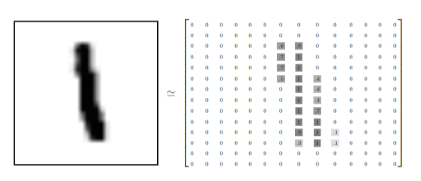
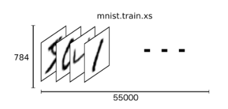
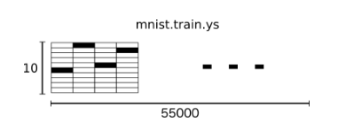
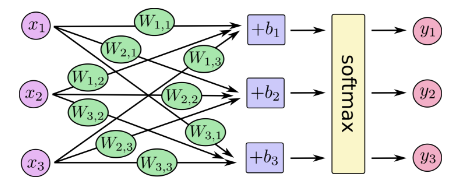

# 基本说明
MNIST 数据集对于TensorFlow使用而言，就相当于是Hello World对一般高级语言一样，占据着基础性重要地位。

这部分对新手的内容主要是**训练一个模型来估测MNIST数据集中的数字是什么**.

细化而言，我们将在这篇文章中完成以下内容:
- 学习MNIST数据集和softmax回归
- 基于图片中的每个像素点创建函数模型来识别数字
- 通过TensorFlow来训练模型去识别数字
- 通过测试数据来检验模型的准确性

# MNIST数据
每个MNIST数据集由两部分组成：
- 手写的数字
- 对应的标签
我们将会将手写的数字点阵称之为x，而对应的标签称之为y。

MNIST是由Yann LeCun的个人网站进行维护的，整个数据集中包含55000个训练数据集，10000个测试数据集和5000个交叉验证集。
我们可以通过如下操作进行该数据集的下载与读取:

> from tensorflow.examples.tutorials.mnist import input_data

> mnist = input_data.read_data_sets("MNIST_data/", one_hot=True)

MNIST中的手写数字是一个28*28的点阵图片，如图所示：

而每个手写数字我们进行维度展开则可以直观表示为如下形式:

而将所有的标签进行展开可以表示成如下形式:

值得注意的是，我们在进行维度可视化展开时，使用到了one-hot 向量，one-hot向量就是该向量中除了一个元素为1，其他均为0的向量。这在表述标签是0-9中的哪个数时有很大的好处。

# Softmax 回归
sofwmax模型可以用来给不同的对象分配概率，同时使其概率之和为1。即使是我们使用复杂的更加精细化的模型，最后一层往往也是使用的softmax。
我们在tensorflow中对softmax模型的使用分为两步：

1. 对得到某张照片上呈现的是哪个数字的evidence，我们需要对图片像素值进行加权求和。
如果该照片有很强的证据证明其不属于某类，那么相应的权值为负值。相反对应的权值为正数。

2. 将得到的evidence 转变为概率值。

softmax进行图形化表示则是如下形式：

其中，x向量组对应于MNIST中的784个像素点，而各个加权是各个像素点与对应的one-hot向量的相似性程度的表示，其中b向量组是bias，最后由于通过evidence得到的加权值不能保证为概率值，因此最后通过softmax将其转换为对应的概率值。

总的说来，使用softmax在此处的表示形式为:

y = softmax(Wx+b)。

# 实现回归模型
