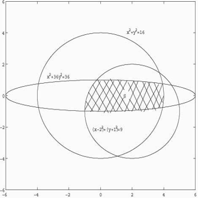

# 相关概念
## 什么是计算机仿真
计算机仿真是用计算机对一个系统的结构和行为进行动态演示，以评价或者预测一个系统的行为效果，为决策提供指导信息的一种方法。它也是解决较复杂的实际问题的一种行之有效的途径。

## 计算机仿真的分类
计算机仿真可以分为如下两个大类：

- 离散型的系统仿真；
- 连续性的系统仿真

## 进行仿真的理由
- 在实际系统没有建立前，仿真是对系统的行为或者结果进行研究的一个行之有效的方法；
- 在有些真实的系统之上进行实验会影响系统的正常运行；
- 当人是系统的一部分时，他的行为往往影响实验的效果；
- 在实际的系统上做多次实验，很难保证每次实验的外部条件相同，因此对于实验结果的好坏就难以进行判定；
- 有些实验的时间太长，费用太大，或者是有危险，这使得实验不易进行；
- 有些系统一旦建立之后就无法回归到原始状态

## 仿真应用的方法
- 时间步长法：对于连续型系统的仿真，我们可以设置一个时钟步长观察系统的事件变化
- 线性表法：通过线性表将系统各个节点的事件类型以及发生时间记录下来


# 实例应用
## 不规则图形面积的计算


我们可以通过计算机仿真的方式得到相应的结果，其中将所有x，y的取值划分为小的矩形域。因此可以得到如下程序：
```
x=-2:0.01:6;
y=-2:0.01:2;
s=0;
h=0.01;
for i=1:800
    for j=1:400
        xx=-2+i*h;
        yy=-2+j*h;
        if xx^2+yy^2<=16
            if xx^2/36+yy^2<=1
                if (xx-2)^2+(yy+1)^2<=9
                    s=s+h^2;
                end
            end
        end
    end
end
s
```
通过上述的分析我们可以知道，将其微分然后求和之后的结果近似可以表示不规则图形的面积。


