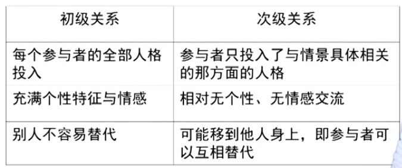

# 社会群体
## 什么是群体
### 群体
群体是人群的集合，需要有持续的社会互动，同时有着某种社会关系以及某种结构，群体之间成员有着诸如共同认同，共同期望等的群体文化。
### 聚集体或集群
暂时出于同一空间而互补隶属的个体之和。
### 社会类属或类群
将具有某种特别社会特征的人的综合。如大学生，全部男生等。
## 群体的类型
- 根据群体成员间关系的密切程度可以分为初级群体和次级群体。初级群体是以感情为基础而形成的，如家庭、朋友等，而次级群体是以特定的目标而形成的，如学校，政府部门等，相对而言亲密程度较低。
- 根据群体的正规化程度可以分为正式群体和次级群体；
- 根据群体内人际关系发生的缘由及其性质划分。血源群体，地缘群体，趣源群体，业源群体。

## 初级群体
初级群体以类似于情感为基础的群体
### 初级关系
- 充满了个人的独特性格，不容易转移
- 初级关系是充满感情的交流
- 初级关系中的互动包含了人格的多个方面，甚至全部

因而，初级群体就是以初级关系为基础形成的群体。

## 次级群体
为了达到一定的目标而特别设计的群体，因此，次级群体更多地被称之为组织。

## 初级关系和次级关系比较

## 我们为何会形成两个群体
人类的需要分为表意性得需要和工具性需要。表意性需要是情感支持自我表达，这是初级群体，而工具性需要是指为了满足某些特定的任务而联系，这是次级群体。
但是这两种群体并非是独立的。
## 初级群体的功能
### 正功能
- 社会化基本场所，提供了人格充分发展的机会
- 满足生存安全，社会交往，精神愉快等多方面需求
- 有利于维护社会秩序，减少群体来自于社会压力，从而维持秩序
### 负功能
- 微观角度看，初级群体可能压抑个性的形成和个人积极性的发挥，限制个人的社会发展；
- 宏观角度看，正规组织中初级群体的存在可能破坏组织结构，妨碍组织效率的提高与组织目标的实现。
## 初级群体价值衰落的表现
- 功能外移(教育、娱乐等)
- 成员关系松懈
- 有些群体名存实亡(邻里)
## 初级群体衰落的原因
- 工业化--高度社会分工--频繁流动--制约亲戚、邻里关系形成
- 现代化--工具理性--忽视初级群体价值(情感支持)

## 群体的结构
人们待在一起的时间足够长，几乎总会有社会结构的产生。同时，形成结构，是人类群体的一种倾向。因为一方面人类对稳定的社会环境的需要，另外一方面个人不同的天赋与特征也有助于社会结构的产生。
### 社会群体描述
- 规模
- 规范
- 角色
#### 规模
随着小群体的逐渐增大，稳定性越来越强，紧密型越来越弱。

**群体的规模取决于它的目标**。
### 群体规范
群体行动的方式以及违规意味着什么。
#### 群体均有规范
无论是初级群体还是次级群体，都存在相应的规范。
### 群体角色
群体成员在群体中扮演的不同角色。这个不同角色是由于人格特征、知识水平、技术专长的不同而实现的。

## 群体中的个体
### 群体规模对人们的影响
群体规模影响到了我们帮助他人的意愿，更大的群体成员感到了责任分散。同时群体的规模也影响了成员关系的亲密性。此外，群体规模增加，会影响人们的直接互动。
### 群体角色对人的影响
在群体中扮演的角色，会对个人心理，甚至人格产生影响。
### 群体对个人决策的影响
群体上存在着遵从。
- 信息遵从
人们在表达自己亲见的现实时，受到群体的影响
- 规范遵从
主要是害怕受到拒斥
- 服从
认同于现实的或者想象中的领导期望

# 社会组织
## 什么是组织
社会学研究的组织是指，人们为了实现某个目标而联合的一个团体。
组织是由合作而产生的。
现在组织的特征是人们越来越以高效为目标而构成的团体。麦当劳化、科层制都是用来描述组织的特征。

## 组织的构成
- 成员
- 确定的目标
- 规范性的章程
- 权威的领导体系
- 物质基础

## 组织的结构

组织具有正式结构和非正式结构两种。

### 正式结构
- 地位构成
组织中地位，最能够体现的是职位。
- 角色结构
在组织中，特定的地位就有相应的角色期待。
- 结构规范
稳定的规则和规章制度，告诉人们在组织中应当如何行为。规范的有效性取决于组织成员的认同程度。
- 权威结构
权威依附于职位。

## 组织化
### 组织化的优势
可预见、高效率

### 组织化的劣势
可能会导致僵化死板，目标置换(当组织员工只关心自己的目标时，这一现象就会发生)

1. 组织成员热衷于保持他们自己在组织中的地位，只关注这个目标

2. 组织规章制度本身成为了目的。

## 非正式结构
非正式结构不是由组织的制度规定建立的，也不受制度的规范保护。
### 非正式结构的优势与劣势
正式规则和程序并不能解决组织所遇到的所有问题，有时甚至不如非正式规则有效率。
非正式结构也有消极性后果。在非正式团体中，由于害怕受到打击保护，因此非正式结构也可能对其产生不良影响。

## 组织的类型
### 按照功能和目标进行分类
- 经济生产组织
- 政治目标组织
- 整合组织(调整冲突，指导动机)
- 模式维持组织(教会、学校)

### 以受惠者为基础进行分类
- 互惠组织(由共同的兴趣而结合在一起)
- 服务组织(以服务为主要目标)
- 经营性组织(以营利为主要目标)
- 大众福利组织(为所有的社会成员提供服务)

### 根据组织权利类型和组织成员的服从方式进行分类
- 疏远型组织(以强制权利为基础，强迫性)
- 功利型组织(以实在性或非实在性奖励为基础的组织)
- 道德型组织(以劝导或感召将人们的行为引导到社会行为的分配)

### 以产业为标准的组织分类
- 第一产业组织
- 第二产业组织
- 第三产业组织
