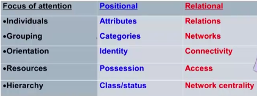

# 社会网络概述
## 什么是社会网络
社会网络是相互联系的社会行动者之间组成的稳定的关系结构。

社会行动者可以是个人，也可以是组织，所以就产生了人际网络与组织网络。人际网络是其基本形式。

## 社会网络的分类

从抽象的角度对社会网络进行分析，可以将社会网络进行如下划分：

- 个体中心网(Ego-Alter Network)：以某个社会行动者为中心，关注个人与关系他人的社会网络，或称自我-他人网络。Ego-Alter Network.

- 整体网(Whole Network)：一定边界内的所有社会行动者之间的社会关系，如班级，小组，社区，组织，团体，国家等。

因此，可以明确地认为，任何个人都有其个体中心网，又属于若干整体网。

## 个体中心网与整体网
### 个体中心网
网络的亲近程度用网络密度来进行计算与分析。
### 整体网
社会网络是基于拓扑学的技术，因此需要掌握其相关的基础性概念。

### 社会网分析基础技术知识
- Point--Nodes
- Line--Connection
- Path--A sequence of lines
- Length of a path: the number of lines making up the path
- Distance: length of the shortest path
- Adjacent: two points connected by a line
- Neighborhood: points to which a particular point is adjacent
- Degree: the total number of other points in its neighborhood
- Centrality: the center of attention

**六度隔离理论**: 只要通过六个人那么可以认识世界上所有的人

## 社会网络与社会学
社会网络分析是处理关系数据的重要工具与手段。

社会网络分析是一种新的社会结构研究范式。 

社会网络分析是社会科学和行为科学的基础知识。

## 小结：社会网视角中的网络时代
- 个人不是孤立的行动者，而是社会网络的扭结

- 一个人扮演多少社会角色，占有多少社会职位，就产生多少个题中心网，进入多少整体网，拥有多少扭结，由此发展与关键他人的纽带关系；

- 互联网时代使网络化的社会更贴近自我，更富有关系的选择性，生活在互联网时代，个人能否减少结构制约，争取个性自由，如果建构个体中心网，是每个理性社会人面临的生存问题、发展问题。

# 社会网络与青少年成长
青少年是在同伴的影响之下成长起来的，同伴影响来自于交友个体网的影响，也来自同期群的影响，前者是个体网视角，后者是整体网视角。

## 个体网视角
同伴效应的概念：通过互动而发生的行为相关性

在一起共事之中，彼此之间的行为具有了相关性，甚至是一致性。个体中心网的角度来看，有两种同伴效应：

1. 正向相关性。当个体寻求目标最大化效应时，将仿效同伴，产生遵从群体规范的行为

2. 负向相关性。顾名思义

## 整体网视角
### 同伴效应因果证明的困境
1. 同质性挑战：选择性交友的同质性，很难证明同伴影响；
2. 同时性挑战：社会互动同时发生，很难区分同伴影响

### 整体网视角的优势
1. 整体网的非选择性：随机分配的大学宿舍、班级
2. 整体网的情景差异性：不同宿舍、班级之间的互动差异

## 小结：社会网视角中的大学生活
- 宿舍和班级是同伴关系和同伴影响的重要来源，与室友和班友的相互尊重，相互学习、相互影响，不是个人选择问题，而是社会结构制约的内在逻辑；

- 个人选择空间是存在的，在同伴效应积极判断的条件下，推动正向行为相关性的最大化；在同伴效应消极判断的条件下，坚持自我，做出负向行为的相关性选择。因此人还是可以在一定程度上选择自身发展的环境的；

- 在校同伴关系将影响大学生的学习成绩、校园参与、社会态度、毕业去向等，从而影响未来人生发展的轨迹。因此要与优秀者为伍。

# 社会网络与地位获得
## 相关概念
## 社会资本理论
## 社会资本的测量
关于此部分的内容在之后进行深入地了解学习

